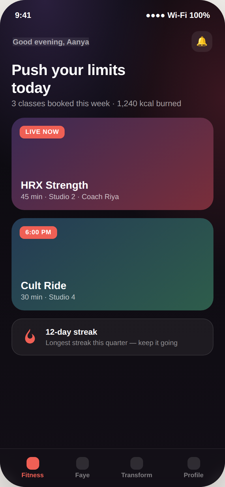
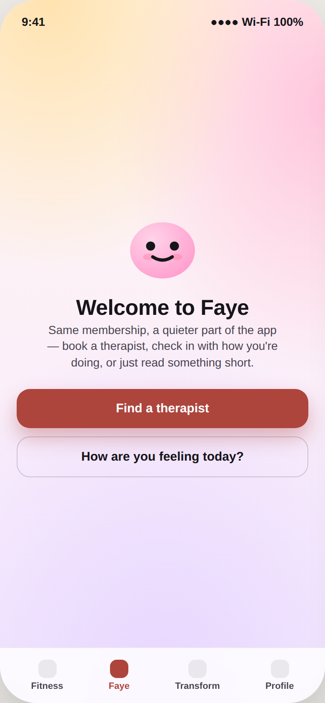
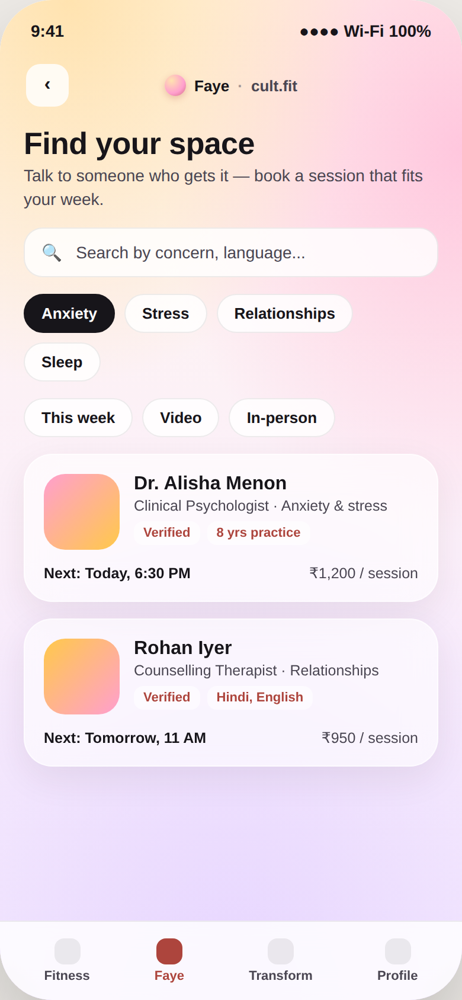
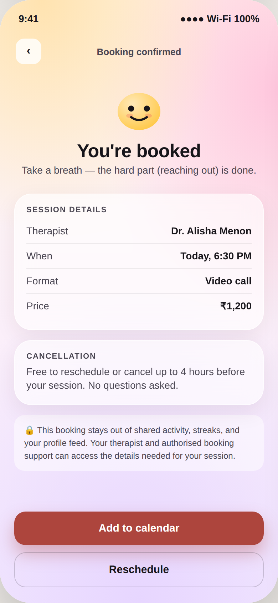
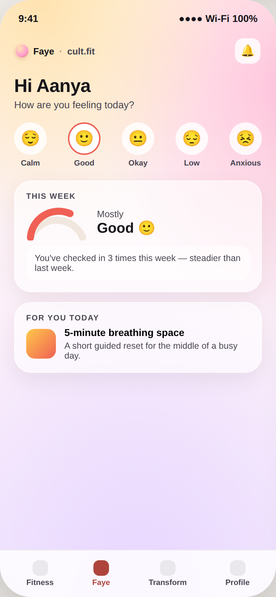
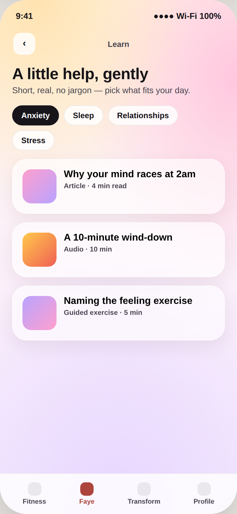

# Kalakriti — Cult.fit mental health pivot

Submission repo for **Kalakriti** ("design your heart out"), theme **Health & Well-Being**, **Scenario 2 — Cult.fit**: an imaginary pivot where Cult.fit expands beyond fitness into on-demand mental health & therapy booking, inside the existing app and membership.

## Status

- **Round 1 deadline: 12:00 IST, 27 Sep 2026** (submit via the organisers' Forms link — this repo is the working hub and, per the rulebook, an acceptable submission format on its own: a public GitHub repo with screenshots in this README).
- Current phase: **four required annotated screens and two context/comparison screens built.** They are design concepts; booking, consent, mood logging, and calendar actions do not connect to live Cult.fit services.

## What this is

Full brief, brand research, and the screen-by-screen content spec live in [`brief/`](./brief). Read `CLAUDE.md` first if you're an AI assistant picking this up — it has the decisions already made and where not to re-litigate them.

- [`brief/rulebook-summary.md`](./brief/rulebook-summary.md) — the actual competition rules, locked scope, brand-fidelity constraints, judging criteria
- [`brief/research.md`](./brief/research.md) — Cult.fit's real design system (Aurora), the core design tension this brief is testing, competitor patterns, internal pattern reuse
- [`brief/screen-flow.md`](./brief/screen-flow.md) — content/IA spec for the four required screens (therapist discovery, booking confirmation, mood-tracking dashboard, content/resource screen)
- [`brief/round-2-prep.md`](./brief/round-2-prep.md) — every Round 2 judging criterion mapped to what's already in this repo, ready to present from if shortlisted
- [`brief/CONTRAST-AUDIT.md`](./brief/CONTRAST-AUDIT.md) — measured contrast checks for the submitted screens, with a clearly labeled historical appendix from a removed prototype
- [`design/DIRECTION.md`](./design/DIRECTION.md) — how the team's visual references were synthesized with Cult.fit's actual Aurora design system
- [`design/BRAND-AND-EXPERIENCE.md`](./design/BRAND-AND-EXPERIENCE.md) — the Faye by cult.fit endorsement, visual rules, naming decision, and official-logo handoff
- [`design/screens.html`](./design/screens.html) — source for the static screens below (open it in a browser to inspect them full-size)
- [`design/UI-UX-IMPROVEMENT-PLAN.md`](./design/UI-UX-IMPROVEMENT-PLAN.md) — planning-only brief for a later visual and interaction refinement; no extra screens are implied to be in the submission
- [`design/STITCH-PROMPTS.md`](./design/STITCH-PROMPTS.md) — ready-to-paste [Google Stitch](https://stitch.withgoogle.com) prompts (one style prompt + one per screen) for anyone exploring visual variations; a reference tool, not a replacement for the audited `screens.html`

## How it sits inside the existing app

Before the four required screens: an **illustrative recreation** of a Cult.fit-style Fitness home (dark, high-energy, streaks) sits next to the proposed **Faye** landing. The Fitness view is concept artwork for this submission, not a screenshot of the live app or proof of integration. One familiar tab transition shows the intended change of register while keeping the existing navigation pattern recognisable.

| Illustrative Fitness home | | Proposed Faye tab landing |
|---|---|---|
|  | → |  |

## Required deliverable

Screen flow covering: therapist discovery → booking confirmation → mood-tracking dashboard → content/resource screen.

| Therapist discovery | Booking confirmation | Mood-tracking dashboard | Content / resources |
|---|---|---|---|
|  |  |  |  |

Design notes, screen by screen:
- **Therapist discovery** — concern/language/availability as tap chips, not a form. No star ratings or public review counts on therapist cards; credential and experience details provide trust signals without implying that other clients have disclosed their care.
- **Booking confirmation** — shown here in its post-confirm state, because for a first therapy booking the real anxiety includes where the appointment appears. The screen explains that it stays out of shared activity and gives a plain-language cancellation policy up front.
- **Mood-tracking dashboard** — expressive icons instead of a 1–10 score (numeric scoring reads clinical), a soft arc trend instead of a dense chart, one suggested action instead of a wall of recommendations, and deliberately **no streaks** even though Cult.fit uses them elsewhere for fitness.
- **Content/resources** — organised by concern (mirrors the discovery filters), every card states its time cost up front, no gamification — the calmest screen in the flow on purpose.

Full reasoning for each decision is in [`brief/screen-flow.md`](./brief/screen-flow.md).

## Product concept beyond the submission

[`product-concept/`](./product-concept) contains the research index, business and persona hypotheses, feature map, technical and consent questions, stress test, a staged [product spec and roadmap](./product-concept/06-PRODUCT-SPEC-AND-ROADMAP.md), and a [consumer review with ranked improvements](./product-concept/07-CROSS-POLLINATION-AND-CONSUMER-REVIEW.md). A first-session prep card, privacy receipt, discreet reminders, and stronger service recovery are **planned improvements**, not parts of the submitted screens. The [UI/UX improvement plan](./design/UI-UX-IMPROVEMENT-PLAN.md) specifies how to refine the existing flow without changing its required order. The Bee (CycleSync) and Relationship AI connections reuse interaction patterns only, with separate consent and no transfer of personal data.

## Team
- Misha Shah, Aarav Wagani, Love Luthra

## Submission format

Rulebook allows a public design-tool link (Figma/Canva/etc.) **or** a public GitHub repo with screenshots in the README — private links are skipped, no exceptions. This repo must stay **public** through submission and judging.
